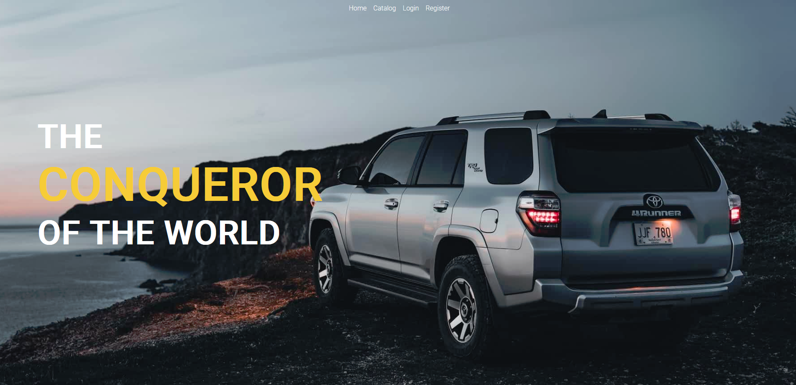
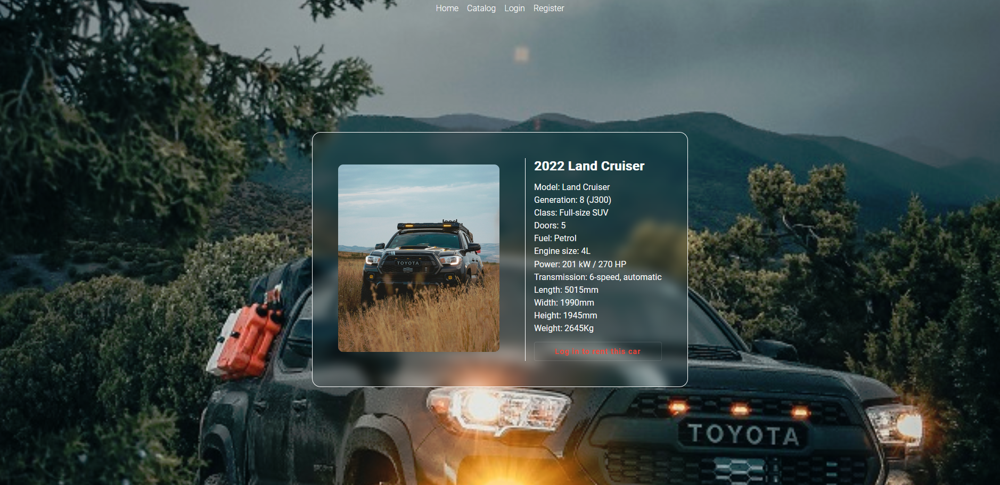
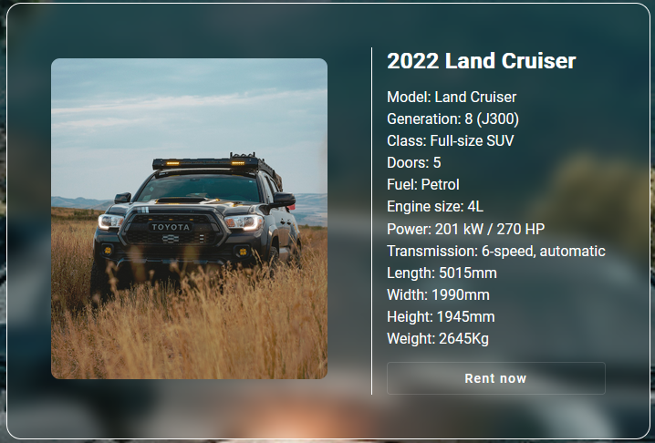
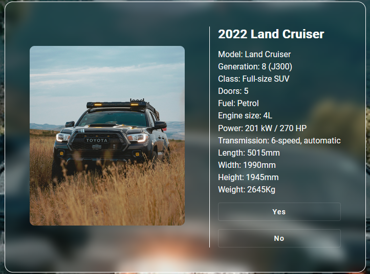
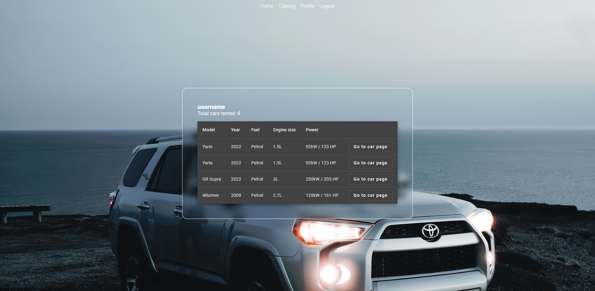

# About the project

This application is made for the SoftUni Angular exam. Its purpose is to provide the users a portal to check out a catalog of Toyota cars and choose one to rent.

## Non logged-in part

This is the part of the application that is accessible to all users.

- Home page

  

  - This is the landing page of the application. It contains a basic welcome banner that has a simple slogan on the left side and dynamic links above it. Non-registered users see links for the login and register pages.

- Catalog page

  
  - This is where the users can see all currently available models, displayed as model cards, containing the car details, as well as a link to the model page.

- Login page
  - This is where the users can log in to their accounts.

- Register page
  - The register page provides a form which anyone can use to register their account.

- Single model page

  
  - This is where the user can view all the cars' details. The user sees the button to rent a car but since he is not logged in, that button links to the login page.

## Logged-in part

Each logged in user can interact with the application in more ways than the guest user.

- Home page

  
  - Logged in users see a link to their profile page as well as to the logout link.

- Single model page

  
  - The user can now see the button for renting the car.

  
  - When clicking on the button, two additional buttons appear to confirm or cancel the action.

- Profile page

  
  - The profile page for the logged in users contains the username, as well as the number of cars the user has rented.
  - It also has a comprehensive table of the cars rented with the most important specs, as well as links to each cars' details page.

## Technology used

- [Angular](https://angular.io/)
- [Angular Material](https://material.angular.io/)
- [NGRX](https://ngrx.io/)
- [SVG Repo](https://www.svgrepo.com/)

## Scripts

```
ng serve
```

Runs the application in development mode on [localhost:4200](http://localhost:4200).

```
ng build
```

Builds the application and places the bundle in the "dist" folder. These are the files that are to be deployed on a web server.

## Credits

[Erik Mclean](https://www.pexels.com/@introspectivedsgn),
[Denys Gromov](https://www.pexels.com/@jdgromov) and
[Isaac Mitchell](https://www.pexels.com/@isaac-mitchell-278678383) for their great images on [Pexels](https://www.pexels.com).
